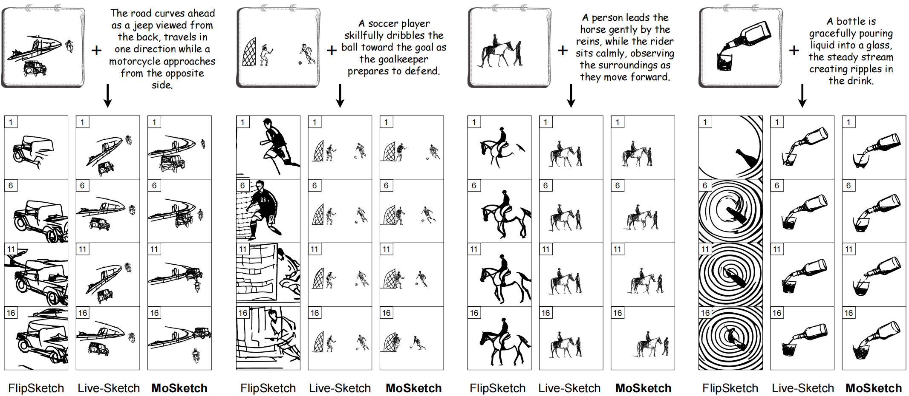
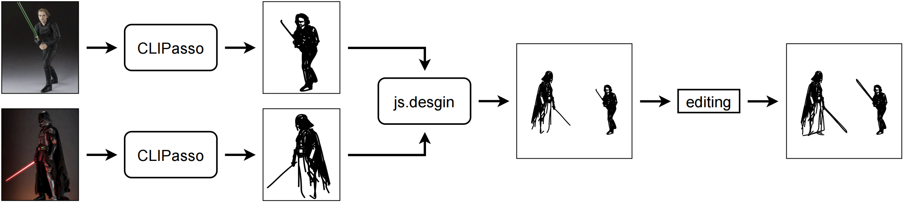

<div align="center">

<h1>Multi-Object Sketch Animation by Scene Decomposition and Motion Planning (ICCV 2025)</h1>

<div align="center">
  <a href="https://rucmm.github.io/MoSketch"></a>&ensp;
  <a href="https://arxiv.org/abs/2503.19351"></a> &ensp;
  &ensp;
  <a href="https://github.com/jyliu-98/MoSketch">
  </a> &ensp;
 &ensp;
</div>

<div>
    <a href='https://scholar.google.com/citations?user=u7Dqok8AAAAJ
    ' target='_blank'>Jingyu Liu</a>&emsp;
    <a href='https://xxayt.github.io/' target='_blank'>Zijie Xin</a>&emsp;
    <a href='https://github.com/jyliu-98/MoSketch' target='_blank'>Yuhan Fu</a>&emsp;
    <a href='https://ruixiangzhao.github.io/' target='_blank'>Ruixiang Zhao</a>&emsp;
    <a href='https://github.com/jyliu-98/MoSketch' target='_blank'>Bangxiang Lan</a>&emsp;
    <a href='http://lixirong.net/' target='_blank'>Xirong Li</a><sup>†</sup>&emsp;
</div>
<div>
    Renmin University of China
</div>

</div>

## :new: Latest Update
- **[2025.08.02]** 🔥 We released **more created multi-object sketches**! There are **560** multi-object sketches now!
- **[2025.07.29]** 🔥 We released the **[project page](https://rucmm.github.io/MoSketch)** for **MoSketch**.
- **[2025.07.26]** 🔥 We released the **[code](https://github.com/jyliu-98/MoSketch)** for **MoSketch**.
- **[2025.06.26]** 🎉 MoSketch is accepted by ICCV 2025!
- **[2025.03.25]** 🔥 We released the **[MoSketch Paper](https://arxiv.org/abs/2503.19351)**. MoSketch is an iterative 
optimization based and thus **training-data free** method, aiming to animate a multi-object sketch *w.r.t.* a specific textual instruction.

## 📄 Abstract
Sketch animation, which brings static sketches to life by generating dynamic video sequences, 
has found widespread applications in GIF design, cartoon production, and daily entertainment. 
While current methods for sketch animation perform well in single-object sketch animation, 
they struggle in *multi*-object scenarios. By analyzing their failures, 
we identify two major challenges of transitioning from single-object to multi-object sketch animation: 
object-aware motion modeling and complex motion optimization. For multi-object sketch animation, 
we propose MoSketch based on iterative optimization through Score Distillation Sampling (SDS) and thus animating a multi-object sketch in a training-data free manner. 
To tackle the two challenges in a divide-and-conquer strategy, MoSketch has four novel modules, 
*i.e.*, LLM-based scene decomposition, LLM-based motion planning, multi-grained motion refinement, and compositional SDS. 
Extensive qualitative and quantitative experiments demonstrate the superiority of our method over existing sketch animation approaches. 
MoSketch takes a pioneering step towards multi-object sketch animation, opening new avenues for future research and applications.

## 🔧 Setup
Download the code of MoSketch.
```
git clone https://github.com/jyliu-98/MoSketch.git
cd MoSketch
```
### 📌 Environment
Create a new anaconda environment and install dependencies.
```
# create a new anaconda env
conda create -n mosketch python==3.8 -y
conda activate mosketch

# install torch and dependencies
pip install -r requirements.txt
```
Install diffvg
```
# install diffvg's dependencies
conda install -y -c anaconda cmake
conda install -y -c conda-forge ffmpeg
# ************************************************
# if 'conda install -y -c conda-forge ffmpeg' gets stuck, try these:
# conda config --add channels https://mirrors.tuna.tsinghua.edu.cn/anaconda/pkgs/main
# conda config --add channels https://mirrors.tuna.tsinghua.edu.cn/anaconda/pkgs/free
# conda config --add channels https://mirrors.tuna.tsinghua.edu.cn/anaconda/cloud/conda-forge
# conda config --set show_channel_urls yes
# conda install -y ffmpeg
# ************************************************

# install diffvg
git clone https://github.com/BachiLi/diffvg.git
cd diffvg
git submodule update --init --recursive
python setup.py install
cd ..
rm -rf diffvg
```
### ⬇️ Checkpoint of T2V Diffusion Model
Download the checkpoint of [ModelScopeT2V](https://huggingface.co/ali-vilab/text-to-video-ms-1.7b/tree/main), and
put it in the code of MoSketch (`./text-to-video-ms-1.7b`).

## ✍️ Input Sketch
The input sketches should be provided in SVG format, where a sketch is composed of strokes 
and each stroke is a cubic Bézier curve controlled by four points, as described in the paper. 
Make sure the input sketches can be processed with diffvg.

**Recommended sketch format:**
* Rendering size: 256x256
* Number of strokes: <300
* Strokes type: cubic Bezier curves
* Stroke width: 1~3

The **60 multi-object sketches** used in the paper are provided in `./data/raw/60sketches`. They can be processed with diffvg.

For own sketch preparation, if you want to generate sketches automatically, we recommend [CLIPasso](https://clipasso.github.io/clipasso/), 
an image-to-sketch method that produces sketches in vector format; if you want to create sketches manually, you can use some free online tools, 
such as [js.design](https://js.design/special/article/svg-online-editors.html). 
Note that sketches created by [CLIPasso](https://clipasso.github.io/clipasso/) can be processed with diffvg, 
while sketches created by [js.design](https://js.design/special/article/svg-online-editors.html) should go through `./preprocess.py`.
```
python preprocess.py --svg_path './data/raw/Yours.svg'
```

**Our preparation process:**
* Creating some single-object vector sketches by [CLIPasso](https://clipasso.github.io/clipasso/).
* Using [js.design](https://js.design/special/article/svg-online-editors.html) to gather the single-object vector sketches in a reasonable scene.
* Using [js.design](https://js.design/special/article/svg-online-editors.html) to edit the multi-object sketch (*e.g.*, add or delete strokes).
* Save the multi-object sketch, and run `./preprocess.py` to make sure the sketch can be processed with diffvg.


**We release 500 more created sketches!** There are 560 vector multi-object sketches now! (`./data/raw/560sketches.zip`)

## 🎥 Generate A Video!
### 🚀 Quick Start
The scene decomposition (`_decomp.txt`), the stroke(point) assignment (`_semantic.txt`) and the motion plan (`_traj.txt`) of the **60 multi-object sketches**
are provided in `./data/processed`. The text instruction of each sketch can be found in `./data/raw/60sketches/caption.txt`. 
Run this command to get the animation of one sketch (*e.g.*, 'basketball5'):
```
CUDA_VISIBLE_DEVICES=0 python animate_mosketch.py \
        --sketch 'basketball5' \
        --caption 'The player soars through the air with a basketball, arm extended for an electrifying slam dunk to a hoop.' \
        --num_iter 500 \
        --seed 130 \
        --num_frames 20
```
The output video will be saved in `./output/basketball5`.

The scene decomposition, stroke(point) assignment and motion plan of the **500 more created sketches** are provided in `./data/processed/560sketches.zip`.
Use the above command to animate them!

### 👩‍🎨 Animate Your Own Sketch
The scene decomposition, the stroke(point) assignment and the motion plan of your own multi-object sketch should be provided before animation,
and the format should follow the 60 created sketches. Make a new folder `./data/processed/Yours`, and put the vector sketch (`Yours.svg`) in it.
#### 🧩 Scene Decomposition
We use LLM to get the scene decomposition of the multi-object sketch. The LLM is not limited.
We recommend GPT-4, especially ChatGPT-4, to get the result and check it in real time. 
The instruction and examples are provided in `./data/examples-for-scene-decomposition`. 
Save the result in `./data/processed/Yours/Yours_decomp.txt`, 
and the format should be the same as the 60 created sketches (*e.g.*, `/data/processed/aircrafter3/aircrafter3_decomp.txt`). 
#### 🧮 Stroke(point) Assignment
The stroke(point) assignment aims to assign the strokes, as well as the control points, to their belonging objects. 
The stroke(point) assignment is actually the object segmentation task in vector sketch. 
We employ [GoundingDino](https://github.com/IDEA-Research/Grounded-Segment-Anything) to conduct 
object grounding on the multi-object sketch, and then assign strokes to objects based on the bounding boxes. 

First, Your should install [GoundingDino](https://github.com/IDEA-Research/Grounded-Segment-Anything).
Then Copy the code `MoSketch/stroke_assignment.py` in GoundingDino project.
Make a new folder `sketch` in GoundingDino project, and copy the SVG and PNG(256x256) of the sketch in it.
Run `Grounded-Segment-Anything/stroke_assignment.py` (do not forget adding object names in the parameter`--text_prompt`).
Use the sketch 'football7' as an example:
```
export CUDA_VISIBLE_DEVICES=0
python stroke_assignment.py \
  --config GroundingDINO/groundingdino/config/GroundingDINO_SwinT_OGC.py \
  --grounded_checkpoint groundingdino_swint_ogc.pth \
  --sam_checkpoint sam_vit_h_4b8939.pth \
  --sketch_dir "sketch" \
  --sketch_img football7.png \
  --box_threshold 0.2 \
  --text_threshold 0.2 \
  --iou_w 1.0 \
  --text_prompt "soccer player,goalkeeper,ball,goal" \
  --device "cuda"
```
The stroke(point) assignment are saved in `football7_semantic.txt`, which lists objects and their strokes (IDs in SVG).
Objects' bounding boxes are written in `football7_bbox.txt`. `football7_color.svg` is the visualization of stroke(point) assignment, 
and you can check it with color-object pairs printed in the output. Copy these files to the processed folder (`MoSketch/data/processed/football7`).

**Note that:**
* `--box_threshold` and `--text_threshold` are the semantic thresholds in GoundingDino. 
`--iou_w` is a parameter about the object overlap (more `--iou_w` means more tolerance for overlap).
Adjust these three parameters flexibly during the stroke(point) assignment.
* Sometimes object names should be replaced to get the correct object grounding in GoundingDino, 
*e.g.*, 'basketball` &rarr; 'ball', 'player' &rarr; 'man'.
* If there are more than one objects in sketch sharing the same name, repeat the name in `--text_prompt`. For example, 
'hurdle9.svg' has three athletes:
```
export CUDA_VISIBLE_DEVICES=0
python stroke_assignment.py \
  --config GroundingDINO/groundingdino/config/GroundingDINO_SwinT_OGC.py \
  --grounded_checkpoint groundingdino_swint_ogc.pth \
  --sam_checkpoint sam_vit_h_4b8939.pth \
  --sketch_dir "sketch2" \
  --sketch_img huldres6.png \
  --box_threshold 0.2 \
  --text_threshold 0.2 \
  --iou_w 1.0 \
  --text_prompt "hurdle,athlete,athlete,athlete" \
  --device "cuda"
```

#### 🚗 Motion Planning

